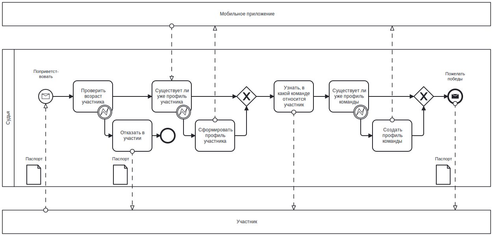
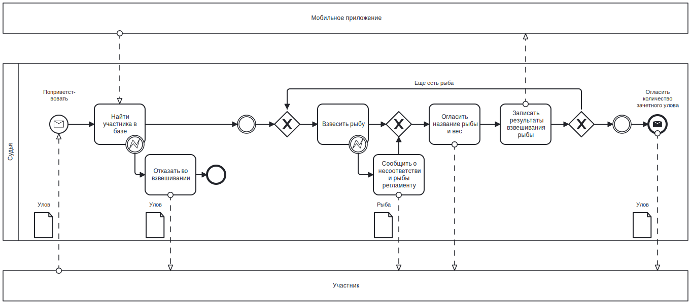

# PPO - код проекта находится в [репозитории](https://github.com/poliorang/CP_DB_BMSTU_6_semester) курсовой работы по БД

## Мобильное приложение для проведения соревнований Российской Федерации Подводного Рыболовства

### Краткое описание идеи проекта  
Соревнования Российской Федерации Подводного Рыболовства проходят в 2 дня: каждый из участников команды (команда состоит из 2 или 3 человек) приносит на взвешивание подстреленную рыбу, судьи взвешивают ее, фиксируют вес и полученные очки за каждую единицу. По итогам первого дня необходимо иметь промежуточный командный и личный рейтинг, по итогам второго дня - финальный командный и личный рейтинг.  

Необходимо создать приложение, чтобы упростить процесс проведения соревнований: реализовать БД, предоставить возможность наполнять ее данными и производить операции над ними посредством интерфейса мобильного приложения.  

### Краткое описание предметной области  
Предметная область - соревнования по подводной охоте: регистрация участников, добавление данных об улове, составление и сортировка рейтинга. 

### Актуальность и целесообразность  
С детства являюсь свидетелем описанного выше процесса (только очки считаются вручную и на калькуляторе, а рейтинг составляется на бумажке) - автоматизировать данную процедуру просто необходимо. Особенно будет содручно при большом количестве участников.

### Use-Case  


### ER (В нотации Чена)


### ER 


### Пользовательские сценарии  

`Участник`- пользователь, обладающий возможностью просматривать командный и личный рейтинги по любым этапам соревнований, устанавливать параметры поиска, а также искать профили конкретных участников и команд. Роль не требует авторизации.  

`Судья` — пользователь, обладающий возможностями участника, а также возможностью создавать и удалять соревнования, создавать, редактировать и удалять участников, команды, добавлять участников в команды и удалять из команд, добавлять, редактировать и удалять уловы участников в этапы соревнований. Роль требует авторизации.  

`Администратор` — пользователь, обладающий возможностями участника и судьи, а также возможностью редактировать и удалять профили судей. Роль требует авторизации.   

#### Типичный сценарий:  
1. В 9:00 первого дня к судье приходят участники. Судья создает для каждого участника профиль с его данными. Формирует участников в команды по 2-3 человека.  
2. В 11:00 начинаются соревнования - участники уплывают, охотятся за рыбой.  
3. В 17:00 участники выходят из водоема, приносят подстреленную рыбу на взвешивание. Судья взвешивает каждую рыбу, засчитывает участнику вес и очки. Очки для каждой рыбы подсчитываются одинаково: +500 к весу. Также есть ограничение: вес рыбы должен не превышать 7500 гр и не быть менее 500 гр. На основе полученных данных производится подсчет личного и командного рейтинга за первый день. 
4. Во второй день пункты (2) и (3) повторяются. Производится подсчет общего (за 2 дня) линого и командного рейтингов.


### BPMN 

#### Регистрация  


#### Взвешивание  



### Тип приложения и технологический стек  

Тип приложения - Мобильное приложение под iOS  
Технологический стек - Swift, Realm (от MongoDB)  

#### Диаграмма компонентов  


#### UML  


## Детали реализации  

### Стек технологический
- Swift
- UIKit
- Верстка: `AutoLayout`
- БД: `Realm` от `MongoDB`  
- Unit-тестирование: `XCTest`  

### SOLID  
Реализация Dependency Inversion из принципов SOLID в Swift - протоколы - позволяют задать требования без реализации. Интерфейсы в uml реализованы в виде протоколов.  

Например, интерфейс `ILootRepository` содержит протокол, описывающий методы, которые необходимо реализовать в `LootRepository`. Теперь, когда мы создаем экземпляр `LootService` (который зависит от LootRepository), мы говорим, что lootRepository должен удовлетворять протоколу, и передаем в инициализатор не какой-то конкретный LootRepository.  

```swift
    let lootRepository: ILootRepository?
    
    init(lootRepository: ILootRepository) {
        self.lootRepository = lootRepository
    }
```

### Сложные use-case  
- Рассчет очков за рыбу (+ 500 к весу)  
- Получить рейтинг участников по очкам с заданным этапом  
- Получить рейтинг участников по очкам  
- Получить рейтинг команд по очкам с заданным этапом  
- Получить рейтинг команд по очкам  
